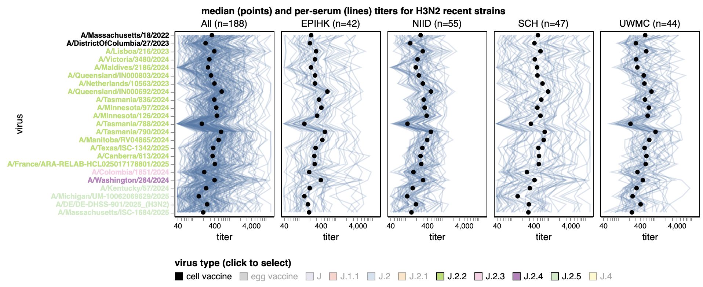
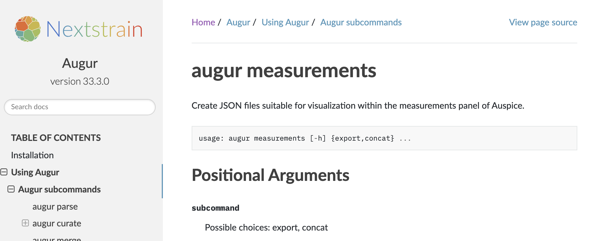

# [Interactive visualizations by line plot emphasize overall trends](https://nextstrain.org/groups/blab/kikawa-seqneut-2025-2026-VCM/h3n2?d=tree&f_kikawa=present_1&p=grid&tl=none&legend=open)

Interactive visualizations implemented with [Vega-Altair](https://altair-viz.github.io/) and [Vega-Lite](https://vega.github.io/vega-lite/) allow users to see overall trends across viruses and people, filter by viral groups and serum groups, and get details on demand for specific people's titers.
[The example visualization here shows H3N2 titers](https://jbloomlab.github.io/flu-seqneut-2025/human_sera_titers_H3N2_recent_individual_sera.html) for all people filtered to just J.2.2, J.2.3, J.2.4, and J.2.5 viruses.

```auspiceMainDisplayMarkdown
## H3N2 titers from human neutralization assays in Kikawa et al. 2025


```

# [Coloring the tree by median titer shows phylogenetic patterns of antigenic drift](https://nextstrain.org/groups/blab/kikawa-seqneut-2025-2026-VCM/h3n2?d=tree&f_kikawa=present_1&p=grid&tl=none&legend=open)

Coloring the tree by median titer across all people highlights viruses with reduced titers.

# [The measurements panel allows us to view individual raw measurements colored by the tree's coloring](https://nextstrain.org/groups/blab/kikawa-seqneut-2025-2026-VCM/h3n2?d=tree,measurements&f_kikawa=present_1&p=grid&tl=none&legend=open)

The measurements panel shows individual measurements as points with details on demand.
The coloring of the tree applies to the measurements panel, too, which shows the individual titers per person and virus.

# [Color tree and filter measurements by cohort median titer](https://nextstrain.org/groups/blab/kikawa-seqneut-2025-2026-VCM/h3n2?c=median_titer_for_SCH&d=tree,measurements&f_kikawa=present_1&label=Subclade:J&mf_source=SCH&p=grid&tl=none&legend=open)

Coloring the tree by median titer for pediatric samples from Seattle Children's Hospital (SCH) shows cohort-specific patterns of neutralization.
The filter interface allows us filter the measurements panel data to show only the "SCH" cohort.

# [Color measurements by clade](https://nextstrain.org/groups/blab/kikawa-seqneut-2025-2026-VCM/h3n2?c=subclade&d=tree,measurements&f_kikawa=present_1&label=Subclade:J&mf_source=SCH&p=grid&tl=none&legend=open)

Coloring measurements by clade highlights clades with overall reduced titers across individuals.

# [Color tree and measurements by genotype](https://nextstrain.org/groups/blab/kikawa-seqneut-2025-2026-VCM/h3n2?c=gt-HA1_189&d=tree,measurements&f_kikawa=present_1&gmax=1052&gmin=66&label=Subclade:J&mf_source=SCH&p=grid&tl=none&legend=open)

Coloring measurements by genotype at specific HA positions similarly highlights specific amino acid substitutions associated with reduced titers.

# [Plot measurements by mean and standard deviation](https://nextstrain.org/groups/blab/kikawa-seqneut-2025-2026-VCM/h3n2?c=gt-HA1_189&d=tree,measurements&f_kikawa=present_1&gmax=1052&gmin=66&label=Subclade:J&m_display=mean&mf_source=SCH&p=grid&tl=none&legend=open)

We can plot measurements by mean and standard deviation to get an overview of the titer differences for the current coloring groups.

# [Titer models estimate effects of substitutions across all people](https://nextstrain.org/groups/blab/kikawa-seqneut-2025-2026-VCM/h3n2?c=cTiterSub&d=tree,measurements&f_kikawa=present_1&m_display=mean&mf_source=SCH&p=grid&tl=none&legend=open)

Titer models computationally identify amino acid substitutions that explain differences in titers and quantify the effects of each substitution.
The cumulative sum of these substitution effects across the tree shows the estimated antigenic advance per strain.
[See Neher et al. 2016 PNAS](https://doi.org/10.1073/pnas.1525578113) for more details about the titer model.

# [Titer model estimates effects of substitutions across all people](https://nextstrain.org/groups/blab/kikawa-seqneut-2025-2026-VCM/h3n2?c=cTiterSub&d=tree,measurements,frequencies&f_kikawa=present_1&m_display=mean&mf_source=SCH&p=grid&tl=none&legend=open)

When we turn on the frequency panel, we see that antigenic advance tends to increase over time for the H3N2 viruses measured by neutralization assays with human data.

# [Collapse tree tips into stream plots](https://nextstrain.org/groups/blab/kikawa-seqneut-2025-2026-VCM/h3n2?c=cTiterSub&d=tree,measurements,frequencies&f_kikawa=present_1&label=Subclade:J.2&m_display=mean&mf_source=SCH&p=grid&streamLabel=Subclade&tl=none&legend=open)

Streamtrees collapse multiple tips per clade into stream graphs.
This view summarizes the antigenic advance per clade.

# [Nextstrain documentation has more details](https://nextstrain.org/groups/blab/kikawa-seqneut-2025-2026-VCM/h3n2?c=cTiterSub&d=tree,measurements,frequencies&f_kikawa=present_1&label=Subclade:J.2&m_display=mean&mf_source=SCH&p=grid&streamLabel=Subclade&tl=none&legend=open)

See [documentation for augur measurements commands](https://docs.nextstrain.org/projects/augur/en/latest/usage/cli/measurements.html) for more details about the interface for creating your own panel.
See [the measurements panel paper](https://bedford.io/papers/lee-hadfield-measurements-panel/) and [GitHub repository](https://github.com/blab/measurements-panel/) for example workflows.

```auspiceMainDisplayMarkdown
## Example view of Nextstrain documentation


```
